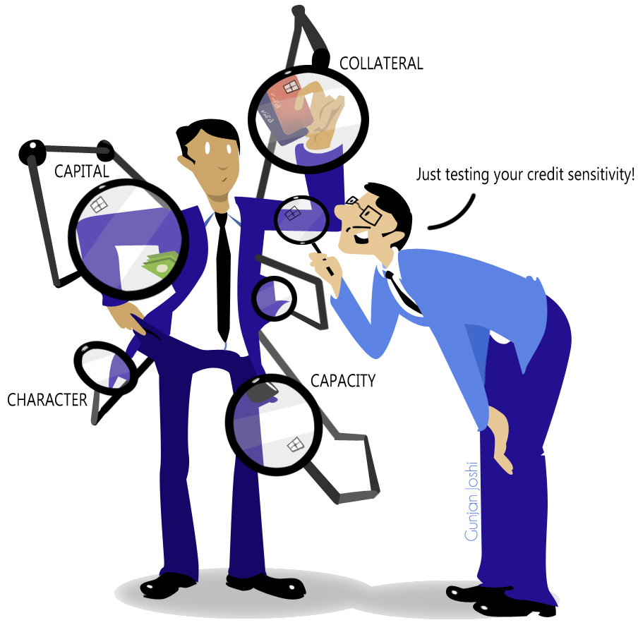
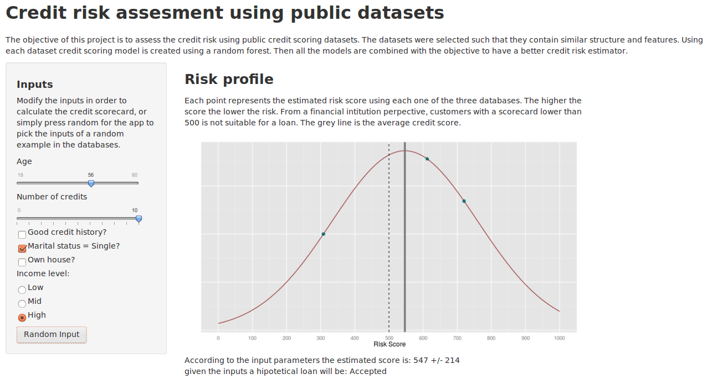

 
========================================================

### DDP Course Project
## Credit risk assesment app using multiple public data sources

Alejandro Correa Bahnsen

Jan 8, 2014
***



Objective
========================================================

The objective of this project is to assess the credit risk using public credit scoring datasets.

The datasets were selected such that they contain similar structure and features.

Using each dataset credit scoring model is created using a random forest.
        
Then all the models are combined with the objective to have a better credit risk estimator.

For more information on credit scoring see http://goo.gl/369Ee

Datasets
===
The following datasets were selected:
GermanCredit http://goo.gl/mZD4cA
KaggleCredit http://goo.gl/F8Xtz
PAKDDCredit  http://goo.gl/V84elI


### Datasets information


```
             PAKDD KAGGLE GERMAN
No. Obs      39988 120269   1000
No. Features    27     12     46
Default Rate 0.198  0.069    0.3
```

The datasets were balanced using the ROSE package


```
                 PAKDD KAGGLE     GERMAN
Balance Method   under  under under/over
New Default Rate 0.501  0.502      0.495
```

Algorithms
===

With the objective of having comparable models, the following features were created:
Perfect credit history; Age; Number of credits;
Marital Status = Single; Residence type = Own; Income. 
(http://goo.gl/Ml082W)

Then, using the random forest library one model is trained for each dataset (http://goo.gl/feT02K)

```r
library(randomForest)
load('datasets.Rda')
# For each dataset i:
data.temp = data[data$set == i, -1]
cla[[i+1]] <- randomForest(factor(default) ~ ., data.temp)
```

App
===

The app is composed of 2 parts:

  - The input panel in which the user can modify the inputs of the scorecard
  - And the output panel in which the calculated score is calculated
  
***

The app automatically recalculate the scores each time an input is modified
